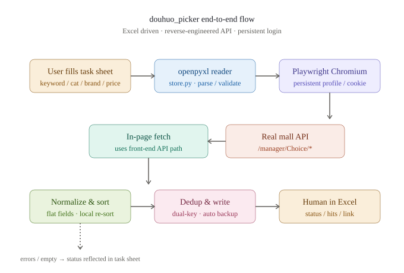

# 抖货商城自动选品（douhuo_picker）

> 把 Excel 选品清单 → 批量检索抖货商城（微唯宝） → 结果回写到同一份工作簿。
> 逆向真实接口而非 DOM 爬取，稳定可靠；登录态一次配置长期复用。



> End-to-end flow: Excel task sheet → openpyxl reader → Playwright Chromium (persistent profile) →
> in-page fetch → real mall API → normalize & local re-sort → dedup & write → human in Excel.

---

## ✨ 这是什么

抖货商城（[https://www.douhuomall.com](https://www.douhuomall.com)）的选品页面是 Vue SPA + 服务端签名校验，普通 HTTP 客户端拿不到完整数据。
本项目通过**逆向前端 JS 包解析真实接口**（`/manager/Choice/getGoodsList` 等），再用 Playwright 持久化浏览器上下文保持登录，
把"读 Excel 选品条件 → 批量检索 → 写回结果"做成一个命令行工具。

一句话定位：**Excel 在左，结果在右，中间全自动。**

## 🚀 核心特性

- **Excel 驱动**：在原清单的同一份 `.xlsx` 里挂「选品任务」与「选品结果」两张表，**不改动原有内容**，写前自动备份。
- **接口逆向**：从 webpack 懒加载分包挖出真实 API（POST + JSON），不靠 DOM 选择器、不靠 Selenium 模拟点击，稳定性 +100。
- **登录态复用**：首次 `--login` 后，登录态保存在浏览器 profile 目录，**长期免登录**。
- **筛选条件齐全**：关键词 / 类目 / 品牌（多选）/ 渠道（多选）/ 价格区间 / 利润率区间 / 仅包邮 / 排序 / 最大条数，
  类目与品牌支持**直接填中文名或数字 ID**。
- **服务端排序不可靠**：利润率/价格抓完在本地重排，结果确定。
- **健壮性**：网络抖动指数退避、登录失效自动重导、Excel 被占用友好报错、文件锁自动重试。
- **试账号安全**：自动识别 `sys_id==11` 的试用账号，**不静默写脏数据**，明确提示后再跑。

## 🛠 技术栈

| 类别 | 选型 | 说明 |
|---|---|---|
| 语言 | Python ≥ 3.11 | 唯一外部运行时 |
| 浏览器自动化 | [Playwright](https://playwright.dev/python/) (Chromium) | 持久化 profile + 页面内 fetch |
| Excel 读写 | [openpyxl](https://openpyxl.readthedocs.io/) | 任务表/结果表/格式 |
| 协议 | HTTP POST + JSON | 走页面内 fetch，Cookie/Referer 与前端一致 |

> **为什么不直接用 requests？** —— 站点接口依赖浏览器上下文里的会话和 Referer 校验，
> 在 `requests` 里硬造 cookie 极易被反爬。Playwright + 页面内 fetch 是最稳的桥。

## 📦 安装

### 1. 准备 Python 环境

```bash
# 推荐 Python 3.11+，本项目在 3.13.12 验证
python --version
```

### 2. 创建虚拟环境并安装依赖

```bash
# 进入项目目录
cd 选品询价清单(v1.20260901)/douhuo_picker

# 用项目自带 venv（Windows / PowerShell）
python -m venv .venv
.\.venv\Scripts\Activate.ps1

# 或 macOS / Linux
python3 -m venv .venv
source .venv/bin/activate

# 安装依赖
pip install -U pip
pip install openpyxl playwright

# 下载 Playwright 浏览器（首次约 150MB）
playwright install chromium
```

> 如果你在中国大陆安装慢，可临时换源：
> `pip install -i https://pypi.tuna.tsinghua.edu.cn/simple openpyxl playwright`

### 3. 准备选品清单（首次使用）

把你的询价清单放进工作目录，文件名形如 `询价1-学生文具选品询价清单.xlsx`。
表头需要含 `品类` 或 `系列` 列（脚本据此派生关键词）。

## 🚦 使用方法

### 第一次：先登录

```bash
python run.py --login
```

会弹出 Chromium 浏览器，在弹出的页面里用短信验证码 / 扫码完成登录，**登录后关闭浏览器窗口即可**。
登录态会保存到 `douhuo_picker/state/browser_profile/`，后续不用再登。

> 试用账号能看大部分商品但价格不全，正式账号能拿更多。
> 第一次跑会在终端明确提示「当前是试用账号」，要不要正式登录由你决定。

### 派生任务表 + 干跑预览（不动文件）

```bash
python run.py --init --dry-run
```

只读清单、按品类合并去重，打印派生结果，**不写文件**。
确认无误后去掉 `--dry-run` 真实落盘。

### 真正跑：批量处理

```bash
# 处理当前目录下所有 .xlsx（推荐）
python run.py --init --limit 40

# 处理单个文件
python run.py --excel ../询价1-学生文具选品询价清单.xlsx

# 重跑「已完成」任务（用 --all），并显示浏览器窗口
python run.py --excel ../询价1-学生文具选品询价清单.xlsx --all --headful
```

### CLI 选项一览

```text
usage: run.py [-h] [--excel EXCEL] [--init] [--login] [--headful] [--all]
              [--limit LIMIT] [--profile PROFILE] [--dry-run]
```

| 参数 | 含义 |
|---|---|
| `--excel PATH` | 目标 `.xlsx` 文件或目录，默认上层目录 |
| `--init` | 从询价清单派生「选品任务」表 |
| `--login` | 只做登录（有头浏览器），不抓数据 |
| `--headful` | 采集时也显示浏览器窗口（默认无头） |
| `--all` | 重跑状态为「已完成」的任务 |
| `--limit N` | 覆盖任务表的「最大条数」 |
| `--profile DIR` | 浏览器登录态目录，默认 `state/browser_profile/` |
| `--dry-run` | 只打印将要处理的任务，不抓数据 |

### 「选品任务」表填什么

| 列 | 填什么 | 例子 |
|---|---|---|
| 关键词 | 必填 | 铅笔、抽纸、护眼台灯 |
| 类目 | 名称或数字ID | 家居日用 / 102 |
| 品牌 | 多选用 / 分隔 | 晨光/得力 |
| 渠道 | 多选用 / 分隔 | 京东 / 厂商特卖 |
| 价格下限 / 上限 | 数字（元） | 5 / 30 |
| 利润率下限 / 上限 | 数字（%） | 30 / 80 |
| 仅包邮 | 是 / 1 | 1 |
| 排序 | 中文或英文 | 利润率降序 / cost asc |
| 最大条数 | 数字 | 40 |

## 📦 选品中心五表全量抓取（新增）

关键词选品之外，仓库新增 `douhuo_scraper/`：按首页分区全量导出 5 份 Excel（轮播图商品、每日必看、团购爆品轮播、团购爆品全量、海量优品）。

```bash
cd douhuo_scraper
python run.py --login
python run.py --scrape all --fresh
```

详细说明（中英双语）：[docs/choice-center-scrape.md](docs/choice-center-scrape.md)

- Excel 第 1 行为英文字段键，第 2 行为中文说明。
- 长任务定时打印进度，并写入 `output/progress_status.txt`。
- 轮播图 `link_url` 跳转专区的商品会一并采集。

## 🗂 目录结构

```
选品询价清单(v1.20260901)/
├── LICENSE                          # MIT
├── README.md                        # 本文件
├── CHANGELOG.md
├── .gitignore
├── .github/
│   └── workflows/smoke.yml          # 冒烟测试：跑 --init --dry-run
├── docs/
│   ├── architecture.svg             # 端到端流程图
│   └── choice-center-scrape.md      # 五表全量抓取说明（中英双语）
├── douhuo_picker/                   # 关键词选品核心工具
│   ├── client.py                    # 接口层：Playwright + 页面 fetch
│   ├── store.py                     # Excel 读写：任务表/结果表/去重
│   ├── run.py                       # CLI 入口
│   ├── dedup_existing.py            # 就地校正工具
│   ├── logs/                        # 运行日志（已 gitignore）
│   └── state/                       # 浏览器登录态（已 gitignore）
├── douhuo_scraper/                  # 选品中心五表全量抓取
│   ├── client.py                    # 登录 + 页面内 fetch + 分区 API
│   ├── excelio.py                   # 双行表头 Excel 导出
│   └── run.py                       # CLI：--login / --scrape / --export-only
└── examples/
    └── template.xlsx                # 脱敏后的空表头模板
```

> **注意**：`选品询价清单(v1.20260901).7z` 压缩包、9 份原始 xlsx、跑批前的 `备份_20260901_跑批前/` 目录都是**业务数据**，
> 不入仓（包含商业参考价与内部品类规划）。`examples/template.xlsx` 是给二次开发者看的空表头。

## 🤝 贡献指南

欢迎提交 Issue 与 Pull Request。

### 提 Issue

- **Bug** 报告请包含：操作系统、Python 版本、复现命令、完整终端输出（去掉隐私）、相关 xlsx 表头。
- **功能建议** 请说明动机和场景，越具体越好。
- **接口变动** 抖货商城前端更新后，原脚本可能失灵，请贴出 `getGoodsList` 的最新返回截断即可。

### 提 PR

1. Fork → 在 `main` 上新建分支：`git checkout -b feat/xxx`。
2. 保持代码风格：Python 3.11+ 语法（`from __future__ import annotations`、类型注解）、避免引入新依赖（必要时先在 Issue 里讨论）。
3. 单 PR 一件事；多文件改动请在描述里列清单。
4. 跑通自检：执行 `python run.py --excel ../examples/template.xlsx --init --dry-run` 应能正常预览。
5. 提交信息遵循 [Conventional Commits](https://www.conventionalcommits.org/)（如 `feat:` / `fix:` / `docs:` / `chore:`）。

### 行为守则

友好讨论、聚焦问题、不作人身攻击。Pull Request 的设计讨论以中文为主。

## 📜 许可证

本项目基于 **MIT License** 开源 —— 详见 [LICENSE](LICENSE) 文件。

```
MIT License · Copyright (c) 2026 shenghua
允许商业使用、修改、分发、闭源衍生，但需保留版权与许可声明。
```

## 🚢 首次发布到 GitHub

```bash
cd "C:/Users/shenghua/Desktop/选品询价清单(v1.20260901)"

# 1. 初始化（仅首次）
git init -b main
git config user.name  "shenghua"
git config user.email "你的 GitHub 邮箱"

# 2. 暂存（注意：9 份原始 xlsx / 7z / 浏览器 profile / logs / .workbuddy 都被 .gitignore 挡掉）
git add .

# 3. 看一眼要被提交的内容（应该只有 11 个文件 + 4 个目录里的目标文件）
git status

# 4. 首次提交：Conventional Commits 格式
git commit -m "chore: open-source scaffold (MIT, README, CHANGELOG, .gitignore, CI)

- LICENSE (MIT) and README with architecture diagram
- .gitignore excludes Python cache, Playwright profile, .xlsx/.7z, secrets
- douhuo_picker/ : interface client, excel store, CLI, dedup tool (1040 LoC)
- examples/template.xlsx : sanitized empty header template
- .github/workflows/smoke.yml : Python 3.13 + Playwright dry-run CI"

# 5. 在 GitHub 上先建一个空仓库（建议名 douhuo-picker，Public），
#    然后关联 + 推送
git remote add origin https://github.com/shenghua520/douhuo-picker.git
# 若用 SSH，把上面换成 git@github.com:shenghua520/douhuo-picker.git
git push -u origin main
```

## ⚠️ 合规与免责

- 本工具仅供**拥有抖货商城（微唯宝）合法账号**的用户在自身业务场景使用。
- 请遵守抖货商城的服务协议、robots 规则与所在地区法律法规，**不要**用于绕过付费墙、未授权抓取、批量账号注册等。
- 接口字段与路径来自公开的前端 JS 资源逆向，**不包含**任何破解、绕过安全措施的手段。
- 商用与高频采集请提前与抖货商务/客服沟通授权。
